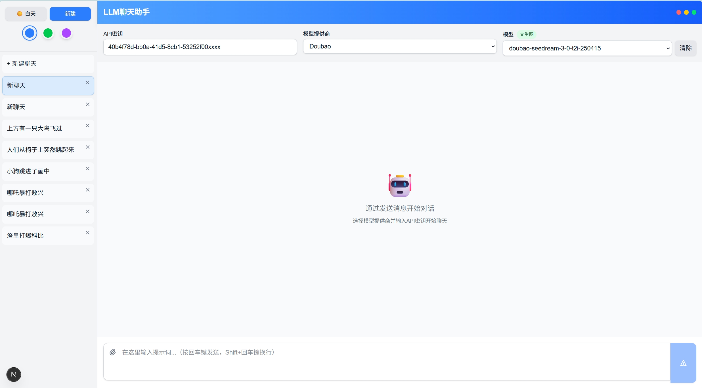

<<<<<<< HEAD
This is a [Next.js](https://nextjs.org) project bootstrapped with [`create-next-app`](https://nextjs.org/docs/app/api-reference/cli/create-next-app).

## Getting Started

First, run the development server:

```bash
npm run dev
# or
yarn dev
# or
pnpm dev
# or
bun dev
```

Open [http://localhost:3000](http://localhost:3000) with your browser to see the result.

You can start editing the page by modifying `app/page.tsx`. The page auto-updates as you edit the file.

This project uses [`next/font`](https://nextjs.org/docs/app/building-your-application/optimizing/fonts) to automatically optimize and load [Geist](https://vercel.com/font), a new font family for Vercel.

## Learn More

To learn more about Next.js, take a look at the following resources:

- [Next.js Documentation](https://nextjs.org/docs) - learn about Next.js features and API.
- [Learn Next.js](https://nextjs.org/learn) - an interactive Next.js tutorial.

You can check out [the Next.js GitHub repository](https://github.com/vercel/next.js) - your feedback and contributions are welcome!

## Deploy on Vercel

The easiest way to deploy your Next.js app is to use the [Vercel Platform](https://vercel.com/new?utm_medium=default-template&filter=next.js&utm_source=create-next-app&utm_campaign=create-next-app-readme) from the creators of Next.js.

Check out our [Next.js deployment documentation](https://nextjs.org/docs/app/building-your-application/deploying) for more details.
=======

# ai-chat-app

```python
This is an AI-CHAT WEB APP writting by Next.js(React) and TypeScript.
这是一个使用Next.js(React) 和 TypeScript 编写的AI聊天网页应用。
```



目前支持的功能：

- 对话聊天（纯文本）
- 文生图片
- 图片编辑
- 文生视频
- 图生视频

目前支持的接口：

- 纯文本模型：Qwen3-235B-A22B-Thinking-2507、Qwen3-235B-A22B-Instruct-2507、DeepSeek-R1、DeepSeek-V3
- 文生图模型： doubao-seedream-3-0-t2i-250415,
- 图片编辑模型：doubao-seededit-3-0-i2i-250628
- 文生视频模型： doubao-seedance-1-0-pro-250528,
- 图生视频模型：doubao-seedance-1-0-lite-i2v-250428 （支持首帧或首尾帧生成）
          

 ## 需要注意的是：

1. 你需要有相应的[API-KEY]()才能正常使用该APP, 纯文本模型调用的是硅基流动（siliconeFlow）的API接口，你需要去[硅基流动官网](https://cloud.siliconflow.cn/me/models)申请一个API-KEY。文生图片、图片编辑、文生视频、图生视频调用的是豆包（Doubao）的API接口，你需要去[火山引擎官网](https://console.volcengine.com/home)申请一个API-KEY并开通相应的模型的使用权限。
2. 文生视频和图生视频[很贵]()！请谨慎使用，目前豆包的视频生成模型亲测效果不是太好，有当前业界生成效果好的模型大家可以留言告知，我会进行测试，若效果好我会添加对该模型的支持
3. UI界面还不是那么美观，有懂CSS的朋友可以pull and push 帮忙改进一下

## 联系方式：

如果有任何疑问或者建议，请联系我或者在github上提问

email:369267184@qq.com
